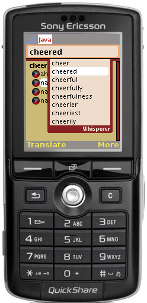

# mdict-j2me
**A J2ME (Java for old Symbian phones) bilingual dictionary. It is not maintained anymore.**

**The Czech-English dictionary in GFDL-cz-en-dictionary-data might be still useful for someone, though.**

MDict is bidirectional offline dictionary for (Symbian) mobile phones.

Features:
* national character support
* quick lookup of writing words
* possible to entry more then one word to search
* result history
* direct translation from result
* clean and easy user interface

Description of MDict archive:
* GFDL-cz-en-dictionary-data - contains last known version of the GNU FDL Czech-English dictionary
* src - dir contain a source code of MIDlet) MDict
* src-index - dir source code of "MDictIndex" tool. It is designed for creating resource index data for targeted midlet
* src-encz - dir source code of "EnCzData". Tool converts "RAW" English Czech data to format which is readable by MDictIndex program.
* res - dir all resource localization, icons, help files
* doc - documentation

Compiling MDict application:
* Import a directories res and src to your selected environment(NetBeans or Eclipse). Configuration of midlet can be CLDC-1.1 and profile MIDP-1.0. Prepare dictionary data with MDictIndex program, copy them into res dir. Change some resource (locales for example) in res dir an compile the program.

Content of res directory:
* language description of MIDLet user interface(locales) - files "language_codelocale" ("enlocale", "czlocale") standard text file in "UTF-8" code page (description is not in scope of this document)
* language version of MIDLet help - files "language_codehelp.html" ("enhelp.html", "czhelp.html") standard text file in "UTF-8" code page. File can contain basic html tags. (description is not in scope of this document)
* picture which describe translated-to language - standard PNG files "language_code.png". Dictionary always has to contain two pictures of targeted languages(Example: for English-Czech dictionary will have en.png and cz.png). * Picture language code will describe below in creating dictionary data section. Recommended resolution of pictures is 20x20 pixels.
* dictionary data files - files i0 to iXXX. Count of files depends on dictionary size. Use program MDictIndex to create them.(Data files are not included)

Creating dictionary resource data with MDictIndex

MDictIndex is designed to create index files for MDict application. Source code is in src-index directory. Compiling:
> javac MDictIndex.java

Running:
> java MDictIndex [-fs -fe -fm -ia -cs] -i input_file -o target_directory

Parameters:

* -fs filter a shorts (example: AA - American Association)
* -fa force using of empty translations (those which are missing second side of translation) It is not tested well I think it is quite useless
* -fm (count) filter those translations which contain more word on each side then "count switch"
* -ia index only by alpha characters exclude a numbers (not implemented yet)
* -cs (size) size of index pages in MIDLet. Standard size is 6000 bytes.
* -i input_file file format is described below
* -o target_directory directory where to store output index files.